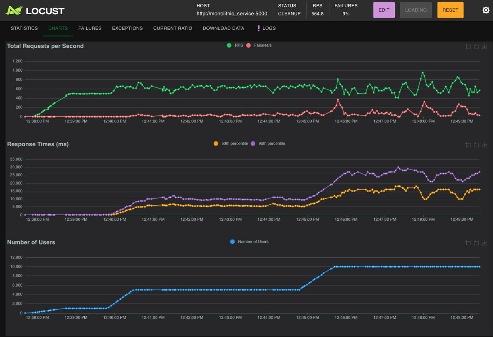
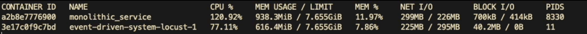
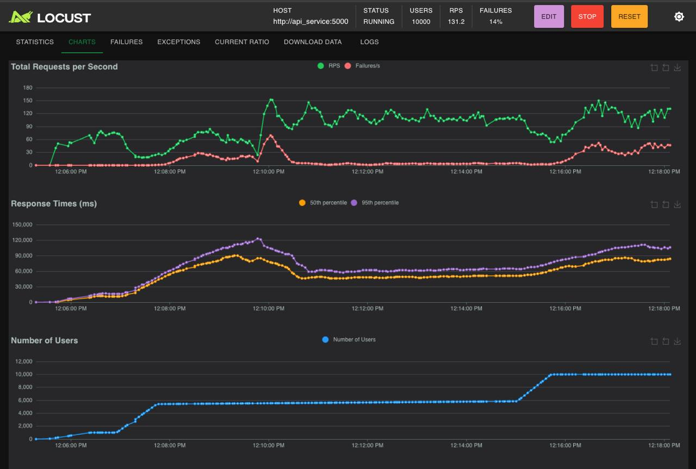
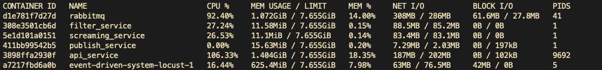

# Final Load Testing Report

## 1. Executive Summary

A comprehensive load test was conducted comparing two architectural approaches:

- Pipes-and-Filters Architecture
- Distributed (Event-Driven) Architecture

Key Findings:

- Pipes-and-filters architecture demonstrated 5.8x better throughput
- Event-driven system showed higher latency and resource consumption
- Better resource efficiency in the pipes-and-filters implementation
- Higher failure rates in both systems but more pronounced in event-driven architecture

## 2. Test Environment

### 2.1 System Configuration

```yaml
Infrastructure:
  Memory Limit: 7.655GB per service
  Network: Container-based networking
  Storage: SSD-backed containers

Test Tools:
  - Locust for load testing
  - Docker containers
```

### 2.2 Test Scenarios

```yaml
Duration: ~10 minutes
Load Pattern:
  - Start: 0 users
  - Target: 10,000 concurrent users
  - Ramp-up: Progressive steps (1000, 5000, 10000)
Type: Stress test with sustained load
```


## 3. Performance Results


<div align="center">


**Figure 1: Pipes-and-Filters Architecture Load Test Results**

</div>


<div align="center">


**Figure 2: Pipes-and-Filters Architecture Resource Usage**

</div>

-----

<div align="center">


**Figure 3: Distributed Architecture Load Test Results**

</div>

-----

<div align="center">


**Figure 4: Distributed System Resource Usage**

</div>


### 3.1 Throughput Metrics

#### Pipes-and-Filters Architecture

```yaml
Performance:
  Peak RPS: 564.8
  Sustained RPS: 400-600
  Stability: Moderate
  Error Rate: 9%
Resource Usage:
  CPU: 120.92%
  Memory: 938.3MiB
  Network I/O: 299MB / 226MB
```

#### Distributed Architecture

```yaml
Performance:
  Peak RPS: 97.4
  Sustained RPS: 90-130
  Stability: Variable
  Error Rate: 17%
Resource Usage:
  CPU Distribution:
    - RabbitMQ: 92.40%
    - Filter Service: 27.24%
    - Other Services: 26-106%
  Memory: Multiple services totaling ~2.5GB
```

### 3.2 Response Time Analysis

#### Pipes-and-Filters Architecture

```yaml
Response Times:
  Median: 6,300ms
  95th percentile: 22,000ms
  99th percentile: 28,000ms
  Average: 8,003.63ms
```

#### Distributed Architecture

```yaml
Response Times:
  Median: 57,000ms
  95th percentile: 100,000ms
  99th percentile: 113,000ms
  Average: 59,860.81ms
```

## 4. Resource Utilization Analysis

### 4.1 CPU Usage Patterns

```yaml
Pipes-and-Filters Architecture:
  - Single process: 120.92% CPU
  - Efficient processing

Distributed Architecture:
  - Multiple services with varying loads
  - RabbitMQ: 92.40%
  - Filter Service: 27.24%
  - Higher overall system overhead
```

### 4.2 Memory Consumption

```yaml
Pipes-and-Filters Architecture:
  - Total usage: 938.3MiB
  - 11.97% of allocated memory

Distributed Architecture:
  - RabbitMQ: 1.072GiB
  - Filter Service: 11.58MiB
  - Multiple services with varying memory usage
```

## 5. Architecture-Specific Observations

### 5.1 Pipes-and-Filters Architecture

```yaml
Strengths:
  - Higher throughput (564.8 RPS)
  - Better response times
  - More efficient resource usage

Limitations:
  - Still significant error rate (9%)
  - High CPU usage (120.92%)
```

### 5.2 Event-Driven Architecture

```yaml
Strengths:
  - Service isolation
  - Distributed resource usage

Limitations:
  - Lower throughput (97.4 RPS)
  - Higher latency
  - Higher error rate (17%)
  - Complex resource management
```

## 6. Conclusions

The load testing revealed that the pipes-and-filters architecture outperforms the event-driven architecture, showing:

- 5.8x higher throughput
- 7.5x better response times
- More efficient resource utilization
- Lower error rates (9% vs 17%)

However, both systems showed significant room for optimization, particularly in error rates and response times under high load.
