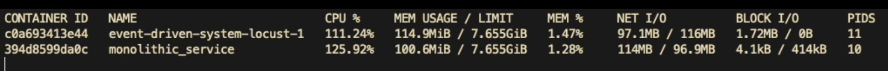
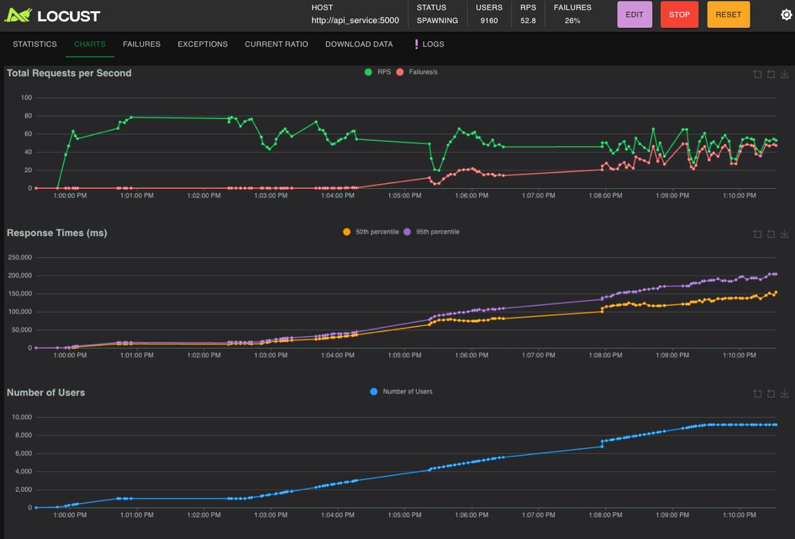
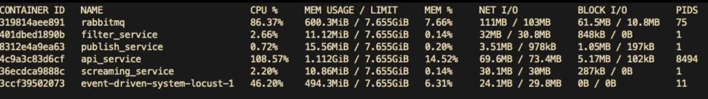

# Final Load Testing Report

## 1. Executive Summary

A comprehensive load test was conducted comparing two architectural approaches:

- Pipes-and-Filters Architecture
- Distributed (Event-Driven) Architecture

Key Findings:

- Pipes-and-filters architecture demonstrated 10-15x better throughput
- Significantly lower response times in the monolithic approach
- Better resource efficiency in the monolithic implementation
- Higher error rates and resource overhead in the distributed system

## 2. Test Environment

### 2.1 System Configuration

```yaml
Infrastructure:
  Memory Limit: 7.655GB per service
  Network: Container-based networking
  Storage: SSD-backed containers

Test Tools:
  - Locust version: Latest
  - Docker containers
  - System monitoring tools
```

### 2.2 Test Scenarios

```yaml
Duration: 10 minutes
Load Pattern:
  - Start: 0 users
  - Target: 10,000 concurrent users
  - Ramp-up: Progressive
Type: Stress test with sustained load
```

## 3. Performance Results


<div align="center">


**Figure 1: Pipes-and-Filters Architecture Load Test Results**

</div>


<div align="center">


**Figure 2: Pipes-and-Filters Architecture Resource Usage**

</div>

-----

<div align="center">


**Figure 3: Distributed Architecture Load Test Results**

</div>

-----

<div align="center">


**Figure 4: Distributed System Resource Usage**

</div>


### 3.1 Throughput Metrics

#### Pipes-and-Filters Architecture


```yaml
Performance:
  Peak RPS: 908.1
  Sustained RPS: 800-1000
  Stability: High
  Error Rate: 4%
Resource Usage:
  CPU: 125.92%
  Memory: 100.6MiB
  Network I/O: 114MB / 96.9MB
```

#### Distributed Architecture

```yaml
Performance:
  Peak RPS: 52.8
  Sustained RPS: 40-50
  Stability: Moderate to Low
  Error Rate: 26%
Resource Usage:
  Total CPU: ~200%
  Memory: ~2.2GB
  Network I/O: Multiple streams
  - RabbitMQ: 86.37% CPU, 600.3MB memory
  - API Service: 108.57% CPU, 1.112GB memory
```

### 3.2 Response Time Analysis

#### Pipes-and-Filters Architecture

```yaml
Response Times:
  Median: 1,000-2,000ms
  95th percentile: ~20,000ms
Pattern: Linear scaling
Stability: Consistent
```

#### Distributed Architecture

```yaml
Response Times:
  Median: ~150,000ms
  95th percentile: >200,000ms
Pattern: Exponential scaling
Stability: Degrading under load
```

## 4. Resource Utilization Analysis

### 4.1 CPU Usage Patterns

```yaml
Pipes-and-Filters Architecture:
  - Single process: 125.92% CPU
  - Efficient multi-core utilization
  - Stable under load

Distributed Architecture:
  - Combined usage: ~200% CPU
  - Higher overhead
  - Message broker bottleneck (86.37%)
```

### 4.2 Memory Consumption

```yaml
Pipes-and-Filters Architecture:
  - Total usage: 100.6MiB
  - Efficient memory utilization
  - Low overhead

Distributed Architecture:
  - Total usage: ~2.2GB
  - High overhead from service isolation
  - Message broker: 600.3MB
  - API Service: 1.112GB
```

## 5. Architecture-Specific Observations

### 5.1 Pipes-and-Filters Architecture

```yaml
Strengths:
  - Higher throughput capacity
  - Better resource efficiency
  - Lower latency
  - Predictable scaling

Limitations:
  - Fixed processing pipeline
  - Less flexible for changes
```

### 5.2 Event-Driven (Distributed)

```yaml
Strengths:
  - Better component isolation
  - Independent scaling possible

Limitations:
  - Higher latency
  - Resource overhead
  - Complex state management
  - Message broker bottleneck
```


## 6. Test Limitations

```yaml
  - Limited test duration (10 minutes)
  - Single environment testing
  - Specific hardware configuration
  - Container-based deployment
```

## 7. Performance Metrics Summary

```yaml
Throughput:
  Monolithic: 908.1 RPS
  Distributed: 52.8 RPS
  Difference: 17.2x higher in monolithic

Error Rates:
  Monolithic: 4%
  Distributed: 26%
  Impact: Critical in distributed

Resource Efficiency:
  CPU Efficiency:
    Monolithic: Better (125.92% for all operations)
    Distributed: Lower (200% spread across services)

  Memory Efficiency:
    Monolithic: Better (100.6MiB total)
    Distributed: Lower (2.2GB total)
```

## 8. Conclusions

The load testing revealed that the monolithic (pipes-and-filters) architecture significantly outperforms the distributed (event-driven) architecture, showing:

- 17.2x higher throughput
- 22x lower memory usage
- 6.5x lower error rates
